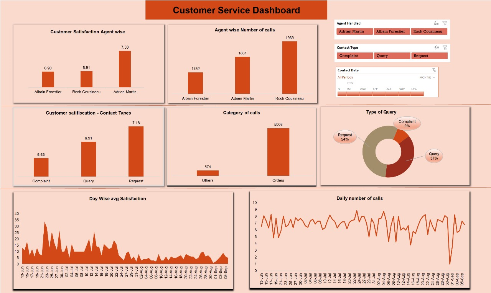

# Excel Dashboards

Welcome to the "Excel Dashboards" repository. This repository contains three Excel dashboards for various analytics purposes.

## Order Analysis Dashboard

The Order Analysis Dashboard provides a comprehensive view of our order data, including key performance metrics, trends, and insights. It allows us to make data-driven decisions to optimize our order processing.

## Finance Analysis Dashboard

The Finance Analysis Dashboard is a powerful tool for financial analysts. It provides in-depth insights into financial performance,Sales trends and customer segmentation, and expense management. Use it to keep your finances in check.

## Customer Service Dashboard

The Customer Service Dashboard helps you monitor and improve customer satisfaction. It tracks customer service performance, Satisfaction trends, and Agent wise performence matrix, enabling you to provide top-notch service.

